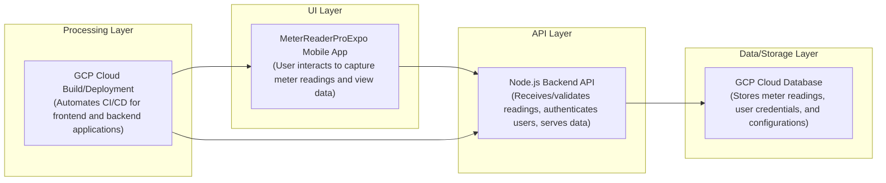

# Meterreaderproexpo

## Overview
*   A mobile application leveraging Expo for automated electricity meter reading.
*   Designed to capture meter images and extract readings using AI/ML.
*   Aims to improve accuracy and efficiency in utility data collection.
*   Built to deploy on Google Cloud Platform (GCP) for robust operation.

## Business Problem
*   Manual electricity meter reading is prone to human error and inconsistencies.
*   Inefficient and costly operational processes for utility providers.
*   Delays in data acquisition impact billing cycles and resource planning.
*   Lack of a scalable, automated solution for accurate meter data capture.

## Key Capabilities
*   Mobile application for capturing meter images directly.
*   Automated extraction of numerical readings from images via AI/ML.
*   Secure storage and management of collected meter data.
*   User authentication for controlled access to the system.
*   Integration with cloud services for scalable processing and storage.
*   Supports efficient data collection for various utility scenarios.
*   Facilitates near real-time data availability for analysis.

## Tech Stack
- Cloud: Google Cloud Platform (GCP)
- Backend: Node.js (for API services)
- Frontend: Expo, React Native, JavaScript
- Data: Google Cloud Firestore
- AI/ML: Google Cloud Vision API or custom ML service

## Architecture Flow
1.  User opens the MeterReaderProExpo mobile application on their device.
2.  User captures an image of an electricity meter using the app's camera feature.
3.  The mobile app uploads the captured image to a designated backend API endpoint.
4.  The backend API receives the image and forwards it to an AI/ML service.
5.  The AI/ML service processes the image, performing OCR or similar analysis to extract the meter reading.
6.  The extracted meter reading is returned from the AI/ML service to the backend API.
7.  The backend API stores the meter reading, image metadata, and user information in a database.
8.  The backend API sends a confirmation and the extracted reading back to the mobile application.
9.  The mobile application displays the validated meter reading to the user.

## Repository Structure
```
.
├── .dockerignore
├── .gitignore
├── App.js
├── app.json
├── assets/
├── cloudbuild.yaml
├── eas.json
├── index.js
├── package-lock.json
└── package.json
```

## Local Setup
1.  **Prerequisites**: Ensure Node.js (LTS), npm, and Expo CLI are installed globally.
    ```bash
    npm install -g expo-cli
    ```
2.  **Clone the repository**:
    ```bash
    git clone https://github.com/ramamurthy-540835/MeterReaderProExpo.git
    cd MeterReaderProExpo
    ```
3.  **Install dependencies**:
    ```bash
    npm install
    ```
4.  **Start the Expo development server**:
    ```bash
    expo start
    ```
    Scan the displayed QR code with the Expo Go app on your mobile device to run the application.

## Deployment
1.  **Backend/API Deployment**: Utilize the `cloudbuild.yaml` configuration for automated CI/CD processes, deploying backend services to GCP (e.g., Cloud Run, Cloud Functions).
2.  **Mobile Application Deployment**: Use `eas.json` and Expo Application Services (EAS) to build and publish the mobile application to target platforms like Apple App Store or Google Play Store.
## Architecture

A mobile-first platform for electricity meter reading and data management..



For a standalone preview, see [docs/architecture.html](docs/architecture.html).

### Key Architectural Aspects:
* Mobile application built with Expo allows users to capture and view electricity meter readings.
* A Node.js backend API hosted on GCP manages user authentication and processes meter reading data.
* Meter reading data and user information are persistently stored in a GCP Cloud Database.
* GCP Cloud Build automates the continuous integration and deployment process for both mobile and backend components.
